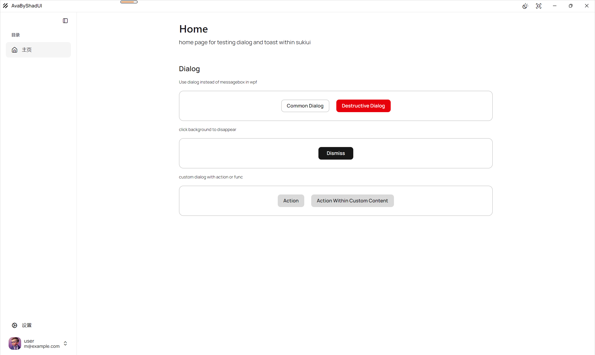

# AvaByShadUI

Avalonia App using ShadUI




依赖注入框架使用 [Jab]([pakrym/jab: C# Source Generator based dependency injection container implementation.](https://github.com/pakrym/jab)) 启动速度相较于DI（Microsoft.Extensions.DependencyInjection）快了很多。同DI一样不支持运行时注入。

需要运行时注入使用[AutoFac]([pakrym/jab: C# Source Generator based dependency injection container implementation.]([Jab]([pakrym/jab: C# Source Generator based dependency injection container implementation.](https://github.com/pakrym/jab))


## 📦 构建与部署

### 发布应用

```bash
# Windows
dotnet publish -c Release -r win-x64 --self-contained

# macOS
dotnet publish -c Release -r osx-x64 --self-contained

# Linux
dotnet publish -c Release -r linux-x64 --self-contained
```


## 🙏 致谢

- [ShadUI]([accntech/shad-ui: Avalonia-based UI Library inspired by shadcn and Suki UI Library](https://github.com/accntech/shad-ui)) - 现代化组件库
- [HotAvalonia](https://github.com/Kira-NT/HotAvalonia) - 热重载功能支持
- [Jab]([pakrym/jab: C# Source Generator based dependency injection container implementation.](https://github.com/pakrym/jab)) - 依赖注入框架
